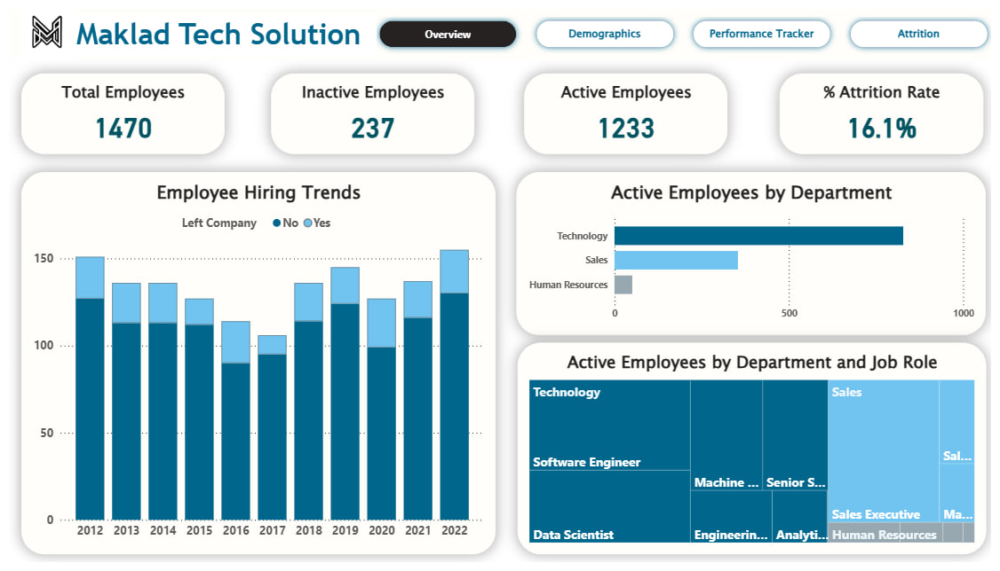
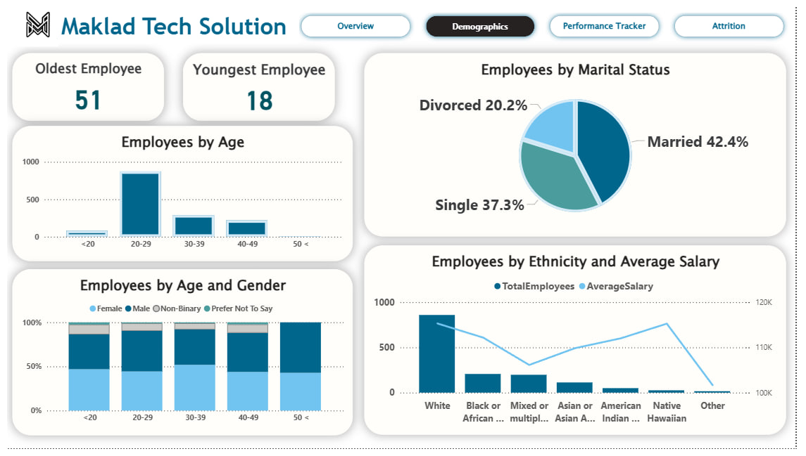
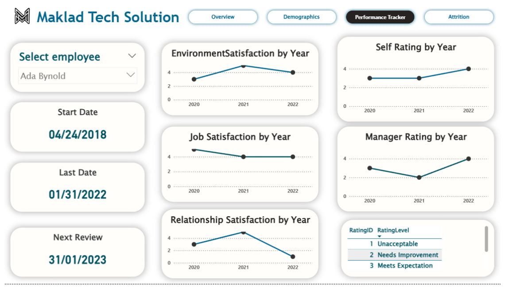
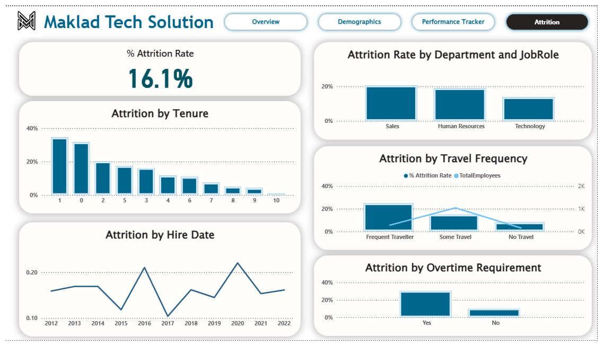

# 📊 HR Analytics Dashboard — Maklad Tech Solution

> A multi-page interactive Power BI dashboard that transforms raw HR data into actionable insights — covering workforce overview, demographics, individual performance, and attrition analysis.


[](https://www.linkedin.com/in/muhammed-maklad)
[](https://muhammed-maklad.github.io/)

---

## 🗂️ Project Overview

Designed and built a full-scale HR analytics solution for **Maklad Tech Solution**, a tech company with **1,470 employees** across Technology, Sales, and Human Resources departments.

The dashboard enables HR managers and leadership to:
- Monitor workforce health at a glance
- Drill into individual employee performance over time
- Identify the root causes behind a **16.1% attrition rate**
- Make data-driven decisions around hiring, retention, and workforce planning

---

## 🎬 Demo

## [HR Dashborad.mp4](Hr%20Fast.mp4) 

## 📸 Dashboard Pages

### 1. 🏠 Overview


The executive summary page high-level KPIs with employee hiring trends and active headcount by department and job role.

| Metric | Value |
|---|---|
| 👥 Total Employees | 1,470 |
| ✅ Active Employees | 1,233 |
| ❌ Inactive Employees | 237 |
| 📉 Attrition Rate | 16.1% |

---

### 2. 👥 Demographics


Interactive breakdown of the workforce by department, job role, age group, gender, and education level — enabling HR to understand the composition of their talent pool.

---

### 3. 📈 Performance Tracker


Employee-level drill-down with year-over-year performance trends. Select any employee to view their full history across:

- 🏢 Environment Satisfaction
- 💼 Job Satisfaction
- 🤝 Relationship Satisfaction
- ⭐ Self Rating vs. Manager Rating

---

### 4. 🚪 Attrition Analysis


Deep-dive into what's driving employee turnover, broken down by multiple dimensions:

- **By Tenure** : Attrition peaks in year 0–1, signaling onboarding risk
- **By Hire Date** : Historical attrition trend from 2012 to 2022
- **By Department & Job Role** : Which teams are losing the most people
- **By Travel Frequency** : Frequent travellers show the highest attrition rate
- **By Overtime** : Employees required to work overtime leave at significantly higher rates

---

## 💡 Key Insights

| # | Insight |
|---|---|
| 1 | **Technology** is the largest department with 850+ active employees  nearly 70% of total headcount |
| 2 | Attrition is **highest in year 1**, pointing to potential onboarding or culture-fit issues |
| 3 | **Frequent travellers** have a ~20% attrition rate vs. ~8% for non-travellers |
| 4 | Employees working **overtime** are more than twice as likely to leave |
| 5 | **Sales** has a disproportionately high attrition rate relative to its headcount |
| 6 | Manager ratings tend to **lag behind self-ratings** in early years but align over time |

---

## 🛠️ Tools & Skills

| Tool / Skill | Usage |
|---|---|
| **Power BI Desktop** | Report design, layout, multi-page navigation |
| **DAX** | Custom measures — attrition rate, active/inactive counts, YoY comparisons |
| **Power Query (M)** | Data cleaning, transformation, and shaping |
| **Data Modeling** | Star schema relationships across HR tables |
| **Bookmarks & Buttons** | Seamless navigation between report pages |
| **Conditional Formatting** | Dynamic color coding for KPIs and ratings |
| **Treemap, Bar & Line Charts** | Department breakdowns and time-series trend analysis |

---

## 📁 Project Structure

```
hr-analytics-powerbi/
│
├── HR_Analytics_Dashboard.pbix     # Main Power BI report file
├── README.md
├── Hr Fast.mp4                     # Dashboard walkthrough video
│
└── screenshots/
    ├── p1.jpg                      # Overview page
    ├── p2.jpg                      # Demographics page
    ├── p3.jpg                      # Performance Tracker page
    └── p4.jpg                      # Attrition Analysis page
```

---

## 👤 Author

**Mohamed Maklad**  
*Data Analyst | Power BI · Python · SQL*

[](https://muhammed-maklad.github.io/)
[](https://www.linkedin.com/in/muhammed-maklad)

---

> 💬 *Have feedback or questions about this project? Feel free to open an issue or reach out directly. Always happy to connect with fellow data enthusiasts.*